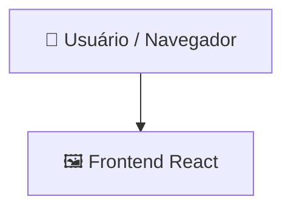

# Gamertag-Generator

> Uma aplicação web leve baseada em React para gerar nomes de usuário (gamertags) exclusivos para jogos online.

   

## 📑 Índice

- [Descrição](#descrição)
- [Principais Recursos](#principais-recursos)
- [Casos de Uso](#casos-de-uso)
- [Capturas de Tela](#capturas-de-tela)
- [Tecnologias Utilizadas](#tecnologias-utilizadas)
- [Arquitetura](#arquitetura)
- [Início Rápido](#início-rápido)
- [Principais Dependências](#principais-dependências)
- [Scripts Disponíveis](#scripts-disponíveis)
- [Configuração do Ambiente de Desenvolvimento](#configuração-do-ambiente-de-desenvolvimento)

## 📝 Descrição

O gamertag-generator é uma aplicação web desenvolvida para ajudar jogadores a gerar nomes de usuário criativos e memoráveis para redes de jogos online e plataformas sociais. Ela oferece uma interface frontend simples e interativa que resolve o desafio comum de encontrar identidades digitais disponíveis ou inspiradoras.

## ✨ Principais Recursos

- **🎮 Interface para Geração de Gamertags** — Fornece uma interface web limpa e intuitiva para gerar nomes personalizados para jogos e identidades online.
- **⚡ Desenvolvimento com Vite** — Utiliza o Vite para oferecer Hot Module Replacement (HMR) extremamente rápido e builds de produção altamente otimizadas.
- **⚛️ Arquitetura Baseada em Componentes React** — Aproveita o modelo de componentes do React para gerenciar o estado no lado do cliente e renderizar a interface com eficiência.
- **🛠️ Verificação de Código com ESLint** — Inclui regras pré-configuradas do ESLint para garantir qualidade e consistência do código durante o desenvolvimento.

## 🎯 Casos de Uso

- Jogadores que procuram inspiração para criar nomes de usuário únicos e criativos para Steam, Xbox, PlayStation ou Discord.
- Desenvolvedores que desejam um modelo simples e pré-configurado com React e Vite para criar aplicações web interativas de geração de texto.

## 📸 Capturas de Tela


## 🛠️ Tecnologias Utilizadas

  

## 🏗️ Arquitetura

Uma visão geral de como os principais componentes se conectam:



## ⚡ Início Rápido

```bash

# 1. Clone o repositório
git clone https://github.com/Juanvic/gamertag-generator.git

# 2. Instale as dependências
npm install

# 3. Inicie o servidor de desenvolvimento
npm run dev
```

## 📦 Principais Dependências

```
react: ^19.2.7
react-dom: ^19.2.7
```

## 🚀 Scripts Disponíveis

- **dev** — `npm run dev`
- **build** — `npm run build`
- **lint** — `npm run lint`
- **preview** — `npm run preview`

## 🛠️ Configuração do Ambiente de Desenvolvimento

### Node.js / JavaScript

1. Instale o Node.js (recomenda-se a versão 18 ou superior).
2. Instale as dependências: `npm install` (ou `yarn`, `pnpm install` ou `bun install`).
3. Inicie o servidor de desenvolvimento: consulte a seção **Início Rápido** acima.

## 👥 Desenvolvido por

Criador do projeto:

<p align="left">
<a href="https://github.com/Juanvic" title="Juanvic"></a>
</p>

</div>